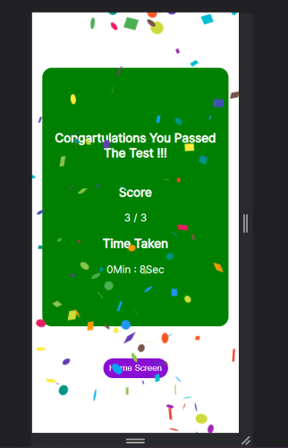

# Merchify Frontend Assignment

## Simple Quiz UI (using React.js and Typescript)

This is assignmet for frontend-engineer Role at Merchify . The Task is to create simple quiz UI using react.js and typescript

### Libraries Used

1. react-router-dom
2. react-icons
3. react-confetti

### App Screens

#### Quiz Details Page

#### Quiz Rules Page

#### Quiz Questions Page

#### Quiz Results Page

### Deployed Link

[Merchify-Assignment-Deployed](https://merchify-frontend-assignment.vercel.app/)

### Instructions for Running Locally

1. Clone the git repository
2. npm install
3. npm run dev
